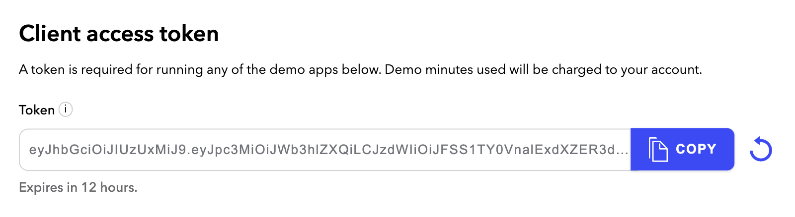

# Dolby.io Web SDK Sample Application

This sample application for the Dolby.io Web SDK is a more complete version of the [getting started](https://github.com/dolbyio-samples/comms-sdk-web-getting-started) project.

## Where to start

If you haven't done so already, create an account on [dolby.io](https://dolby.io/signup), it is free so do it today! Go to your dashboard and for the first application, go to the `Demos` menu and copy the client access token that is provided to you.

Now, simply open the file `index.html` in your web browser and start playing with the application. Paste the access token in the first field. You can access this application at this URL: https://dolbyio-samples.github.io/comms-sdk-web-sample/

> Make sure to read the [JavaScript documentation](https://docs.dolby.io/communications-apis/docs/js-client-sdk-voxeetsdk) for the SDK.

## Features
Here is the list of what you can do in this application:
- Set the WebRTC video constraints
- Change the video camera, the microphone and the output audio device
- Start and stop the local video
- Start, stop, mute and unmute the local audio
- Start and stop the screen sharing
- Play a video file to all participants
- Start and stop the recording
- Start an RTMP stream
- Send a message to the participants
- Invite participants to join the conference

## Open Source Projects

This sample application is using the following Open Source projects:
- [Bootstrap](https://getbootstrap.com)
- [JQuery](https://jquery.com)
- [FontAwesome](https://fontawesome.com)
- [JsRender](https://www.jsviews.com/)

### Big Buck Bunny Video

Big Buck Bunny is licensed under the Creative Commons Attribution 3.0 license.
(c) copyright 2008, Blender Foundation / [www.bigbuckbunny.org](www.bigbuckbunny.org)
